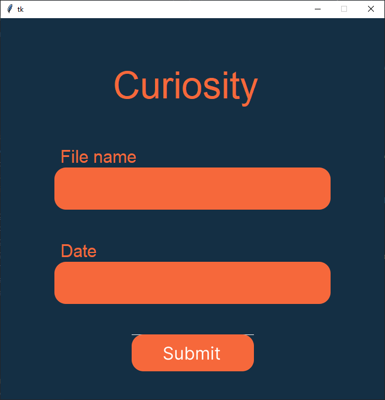

# Curiosity Rover Image Fetcher
python program that uses nasa's api to fetch images from the curiosity mars rover. download the source code from the github release and add your api_key to your `.env` file (or you can use nasa's demo key by setting your api key to `DEMO_KEY`). Image can be fetched by typing `py main.py {file_name.txt} {date(YYYY-MM-DD)}`. you can see the gui by running the `gui.py` file but its very simple. you can also check out the better gui by running the `gui.py` file in the `build` folder but thats not fully fucntional yet.

